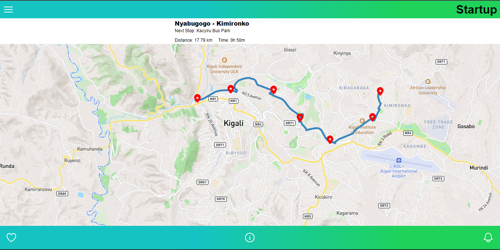

Project Title: Ride-Share-Tracker
=====================================

**Task: Maps API Task**

**Live Site**

**Objective:**
Develop a web page that utilizes the Google Maps API to navigate a route for a ride-sharing service in Kigali, Rwanda. The page should display the estimated time to reach each upcoming stop along the route.

**Project Tasks:**
1. **Bootstrap React Application using Vite**
   - Set up a React application using Vite for rapid development.
2. **Create GitHub Repository and First Commit**
   - Initialize a GitHub repository for version control and commit the initial project files.
3. **Run Application**
   - Ensure the application runs successfully to verify setup.
4. **Render Map**
   - Integrate the Google Maps API to render a map on the web page.
5. **Render Marker**
   - Place markers on the map to represent the starting point, intermediate stops, and ending point.
6. **Display Different Points**
   - Implement functionality to display multiple points of interest, including the starting point, stops, and destination.
7. **Add Duration**
   - Calculate and display the estimated duration to reach each stop along the route.
8. **Add Distance**
   - Calculate and display the estimated distance to each stop along the route.

**Task Details:**
- Create an interactive map displaying the entire route with marked stops.
- Implement real-time tracking of the driver's current location.
- Calculate and display the estimated time of arrival (ETA) for the next stop, assuming a constant average speed.

